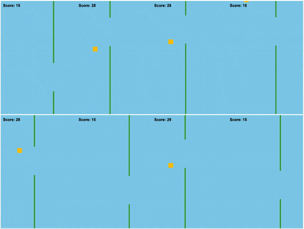

# Flappy-neataptic
Neural network evolution algorithm that with bit of luck learns to play flappy-bird.

## HOWTO
Clone repository, open up index.html into browser and sit back.

## Credits
 - Flappy bird clone: https://github.com/AthulDilip/HTML5-Flappy-Bird
 - Neataptic: https://wagenaartje.github.io/neataptic/docs/tutorials/evolution/
